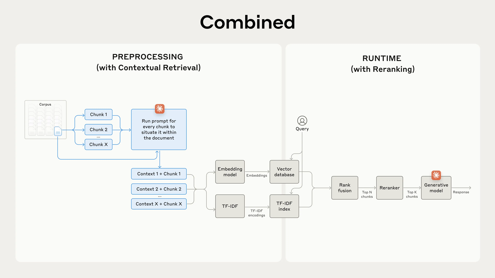
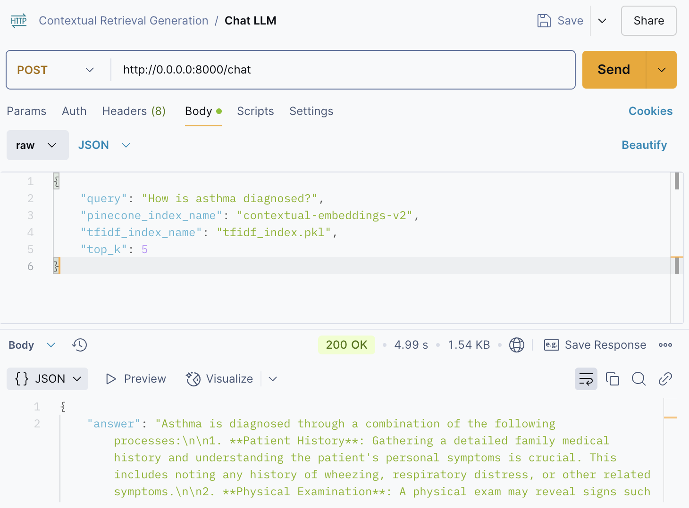

# Contextual Retrieval 🤖📚
This project is a free implementation of Anthropic's research on [Contextual Retrieval](https://www.anthropic.com/news/contextual-retrieval), aimed at improving the conventional Retrieval-Augmented Generation (RAG) system.




## 🤓 Introduction

Contextual Retrieval is designed to enhance the performance of RAG systems by providing more accurate and contextually relevant retrievals. This project leverages various free technologies and APIs, including Pinecone, Ollama, and Cohere, to achieve this goal.

> [!WARNING]
> Pinecone and Cohere have some free limits. Beware of that.

## 🗂️ Prerequisites
- Python
- Ollama
- Pinecone Account
- Cohere Account

## 🔍 Features

- **PDF Text Extraction**: Extracts text from PDF documents.
- **Chunk Generation**: Splits extracted text into manageable chunks.
- **Contextual Embeddings**: Generates embeddings for text chunks using Nomic-Embed-Text Embedding model through Ollama.
- **Pinecone Integration**: Stores and retrieves embeddings using Pinecone.
- **TF-IDF Indexing**: Creates and queries TF-IDF indices for text chunks.
- **Rank Fusion**: Combines results from multiple retrieval methods using Reciprocal Rank Fusion.
- **Reranking**: Reranks retrieved results using Cohere's reranking model.
- **LLM Assistant**: Provides contextual answers using Dolphin Mistral language model through Ollama.


## ⚙️ Installation

1. Clone the repository:
    ```sh
    git clone https://github.com/pollitoconpapass/contextual-retrieval.git
    cd contextual-retrieval-generation
    ```

2. Create and activate a virtual environment:
    ```sh
    python -m venv venv
    source venv/bin/activate  # On Windows use `venv\Scripts\activate`
    ```

3. Install the required dependencies:
    ```sh
    pip install -r requirements.txt
    ```

4. Set up environment variables:
    - Create a `.env` file in the root directory.
    - Add the necessary API keys and configurations as shown
        ```
        # === PINECONE ===
        PINECONE_API_KEY=

        # === COHERE ===
        COHERE_API_KEY=

        # === NECESSARY DATA (NO credentials) ===
        PDF_PATH="./data/for/your/ownPDF.pdf"
        START_PAGE=
        END_PAGE=

        PINECONE_INDEX_NAME="your-own-pinecone-name"
        TFIDF_INDEX_NAME="your_tfidf_index_name.pkl"

        LLM_MODEL_NAME=
        EMBEDDING_MODEL_NAME=
        COHERE_MODEL_NAME =
        ```


## 🧑‍💻 Usage

1. **Ingestion Process (optional)**:
    - Run the ingestion script to process and store text chunks manually:
        ```sh
        python3 ingestion_data_manual.py
        ```

2. **Retrieval Process (optional)**:
    - Run the retrieval script to query the stored data manually:
        ```sh
        python3 process_retrieve_data_manual.py
        ```

3. **API Server**:
    - Start the FastAPI server:
        ```sh
        python3 api.py
        ```

## 🧠 API Endpoints
### Ingestion

- **POST /ingestion**
    - Starts the ingestion process for a given PDF document.
    - Parameters
        - `pdf_path` (str): PDF file path including the .pdf
        - `pinecone_index_name` (str): Pinecone's index name
        - `tfidf_index_name` (str):TF-IDF index name including the .pkl
        - `azure_model` (str): Model you want (gpt4, gpt4-o, etc)

### Context Retrieval

- **POST /context-pinecone**
    - Queries the Pinecone index for contextually relevant chunks.
    - Parameters 
        - `query` (str): User's question
        - `pinecone_index_name` (str): Pinecone index name
        - `top_k` (int): Number of k to retrieve

- **POST /context-tfidf**
    - Queries the TF-IDF index for contextually relevant chunks.
    - Parameters
        - `query` (str): User's question
        - `tfidf_index_name` (str): TF-IDF index name including the .pkl
        - `top_k` (int): Number of k to retrieve

- **POST /rank-fusion**
    - Combines results from Pinecone and TF-IDF using Rank Fusion.
    - Parameters
        - `query` (str): User's question
        - `pinecone_index_name` (str): Pinecone index name
        - `tfidf_index_name` (str): TF-IDF index name including the .pkl
        - `top_k `(int): Number of k to retrieve

### Chat

- **POST /chat**
    - Provides a contextual answer using the LLM assistant.
    - Parameters
        - `query` (str): User's question
        - `pinecone_index_name` (str): Pinecone index name
        - `tfidf_index_name` (str): TF-IDF index name including the .pkl
        - `top_k` (int): Number of k to retrieve


## 🧪 Usage Example
